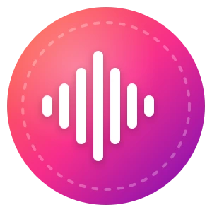

# VoiceWatch

<p align="center">
  
  <!-- VoiceWatch logo redesign pending; current asset is the upstream BirdNET-Go logo -->
</p>
<p align="center">
  <!-- Project Status -->
  <a href="https://github.com/tphakala/voicewatch/releases">
    
  </a>
  <a href="https://creativecommons.org/licenses/by-nc-sa/4.0/">
    
  </a>
  

  <br>

  <!-- Code Quality -->
  <a href="https://golang.org">
    
  </a>
  <a href="https://goreportcard.com/report/github.com/tphakala/voicewatch">
    
  </a>

  <br>

  <!-- Community -->
  <a href="https://github.com/tphakala/voicewatch/network/members">
    
  <a href="https://github.com/tphakala/voicewatch/graphs/contributors">
    
  </a>
  </a>
  <a href="https://github.com/tphakala/voicewatch/issues">
    
  </a>
  <a href="https://discord.gg/gcSCFGUtsd">
    
  </a>

  <a href="https://coderabbit.ai">
    
  </a>
</p>

**Realtime human-voice detector for live audio.**

Self-hosted, 24/7, local AI inference. VoiceWatch ingests soundcard input or network audio streams, runs on-device voice-activity detection, and presents detections in a fast web UI. Runs on a Raspberry Pi. No audio leaves the machine.

> **Project status:** VoiceWatch has pivoted from multi-species bird identification to a single-purpose **human-voice (speech) detector**. The bird/wildlife classifiers, model gallery, range filter, and taxonomy have been removed; detection now uses an embedded [Silero VAD](https://github.com/snakers4/silero-vad) model. The repository name and platform heritage are retained.

## Highlights

- **Embedded speech detection** with the Silero VAD ONNX model — no setup, no downloads, runs out of the box.
- **Local-only inference**. Audio is analysed on-device; nothing is sent to the cloud.
- **Live spectrogram streaming** rendered straight in the browser.
- **Alert rules engine** that routes detections to Discord, Slack, Telegram, ntfy, Pushover, Gotify, Matrix, webhooks, browser push, MQTT (with Home Assistant discovery), and shell scripts.
- **Production-ready ops**: onboarding wizard, OIDC/SSO, TLS certificate management, hot-reload settings, system health page, database doctor, and one-click support dumps.
- **Installable as a PWA**, with 15 UI languages.
- Optional Sentry telemetry is strictly opt-in.

## Quick install

Debian, Ubuntu, and Raspberry Pi OS:

```bash
curl -fsSL https://github.com/tphakala/voicewatch/raw/main/install.sh -o install.sh
bash ./install.sh
```

Docker images are published for `linux/amd64` and `linux/arm64`. Pre-built binaries for Linux, Windows, and macOS ship with each [release](https://github.com/tphakala/voicewatch/releases). See the [installation guide](https://github.com/tphakala/voicewatch/wiki/installation.md), [hardware recommendations](https://github.com/tphakala/voicewatch/wiki/hardware.md), and [security guide](doc/wiki/security.md) for details.

## Web Dashboard


## Features

### Detection

- **Silero VAD** speech detection (embedded, ONNX), analysing audio at the model's native 16 kHz
- Single "Human Voice" class with a per-detection speech-confidence score
- **Configurable false-positive filtering**: Deep Detection (repeat-confirmation within a 15-second window) and per-source confidence thresholds
- Optional privacy filter (off by default) that discards human-voice clips when enabled, plus per-source quiet hours

### Audio inputs

- Soundcard capture and RTSP / RTSPS streams, including multiple sources in parallel
- Audio liveness watchdog with tiered recovery for flaky streams
- Audio equalizer, per-source quiet hours, daylight filter, and extended capture mode
- Offline analysis of audio files

### Interface

- Svelte 5 + TypeScript single-page app
- Installable as a Progressive Web App (PWA)
- Onboarding wizard for first-run setup
- Live spectrogram visualization for active streams ([live audio streaming](https://github.com/tphakala/voicewatch/wiki/BirdNET%E2%80%90Go-Guide#live-audio-streaming))
- Customizable dashboard layout, color schemes, and a "Currently Hearing" card
- Multiselect and bulk actions on the detections list
- Browser terminal (xterm.js over WebSocket PTY) for in-app administration
- 15 UI languages: English, German, French, Spanish, Portuguese, Dutch, Polish, Italian, Czech, Slovak, Hungarian, Finnish, Swedish, Danish, Latvian

### Alerts and integrations

- Configurable alert rules engine with per-rule conditions, schedules, and delivery targets
- Multi-target delivery via [shoutrrr](https://github.com/nicholas-fedor/shoutrrr): Discord, Slack, Telegram, ntfy, Pushover, Gotify, Matrix, Bark, IFTTT, and more
- Webhooks with custom templates, shell-script hooks, and browser push notifications
- MQTT publishing with Home Assistant auto-discovery
- Prometheus metrics endpoint
- Live spectrogram and realtime log output for OBS overlays

### Storage and data

- SQLite (default) or MySQL with retry-aware write paths for contention
- Automatic backups with real-time status polling
- Format-aware audio clip export — every detected voice clip is stored, with a configurable rolling retention (age-based, **21-day default**); older clips are auto-pruned

### Operations

- System Health diagnostics page covering audio pipeline, models and inference, network, and the datastore
- Database doctor for diagnosis and schema repair
- Help & Support page with guided bug reporting and one-click support dumps
- OIDC / SSO with Google, GitHub, and generic providers, including RP-Initiated Logout
- TLS certificate management UI with transactional writes and backup/restore
- Hot-reload for settings and per-source assignments (no restart)
- Optional, opt-in Sentry telemetry with strict privacy filtering

### Platform

- Linux, Windows, and macOS
- Single binary with the Silero VAD model embedded
- Requires the ONNX Runtime shared library ([install guide](https://github.com/tphakala/voicewatch/wiki/ONNX-Runtime-Installation))
- Multi-arch Docker images
- Runs comfortably on a Raspberry Pi 4 or equivalent 64-bit single-board computer

## Documentation

- [FAQ](https://github.com/tphakala/voicewatch/wiki/FAQ) - common questions, issues, and workarounds
- [User guide](https://github.com/tphakala/voicewatch/wiki/BirdNET%E2%80%90Go-Guide)
- [Installation](https://github.com/tphakala/voicewatch/wiki/installation.md)
- [Hardware recommendations](https://github.com/tphakala/voicewatch/wiki/hardware.md)
- [ONNX Runtime installation](https://github.com/tphakala/voicewatch/wiki/ONNX-Runtime-Installation)
- [Database Doctor](https://github.com/tphakala/voicewatch/wiki/Database-Doctor)
- [Cloudflare Tunnel](https://github.com/tphakala/voicewatch/wiki/cloudflare_tunnel_guide.md)
- [Security](doc/wiki/security.md)
- [Telemetry and privacy](doc/wiki/telemetry-privacy.md)
- [RTSP troubleshooting](doc/wiki/rtsp-troubleshooting.md)

## Development setup

> See [CONTRIBUTING.md](CONTRIBUTING.md) for the full guide.

```bash
git clone https://github.com/tphakala/voicewatch.git
cd birdnet-go

# Install Task (if not already installed)
# Linux: sh -c "$(curl --location https://taskfile.dev/install.sh)" -- -d -b /usr/local/bin
# macOS: brew install go-task

task setup-dev    # installs Go, Node LTS, build tools, linters, Playwright
task              # build
task dev_server   # hot-reload dev server (or: air realtime)
```

## Community

Join the [Discord server](https://discord.gg/gcSCFGUtsd) for support, discussions, and updates.

## Related projects

### System integration

- [Cockpit BirdNET-Go](https://github.com/tphakala/cockpit-birdnet-go): web-based system management plugin using the Cockpit framework

### Hardware solutions

- [BirdNET-Go ESP32 RTSP Microphone](https://github.com/Sukecz/birdnetgo-esp32-rtsp-mic): ESP32-based RTSP streaming microphone
- [ESP32 Audio Streamer](https://github.com/jpmurray/esp32-audio-streamer): alternative ESP32 RTSP streaming solution
- [M5Stack Atom Echo RTSP Mic](https://github.com/stedrow/birdnetgo-m5stack-atom-echo-rtsp-mic): RTSP audio server for M5Stack Atom Echo, no soldering required
- [M5Stack AtomS3 Lite PDM Mic](https://github.com/matthew73210/birdnetgo-m5stack-AtomS3-Lite-PDM-rtsp-mic): RTSP audio server with MEMS PDM microphone

## Contributing

Contributions are welcome.

For setup, workflow, and quality gates, see [CONTRIBUTING.md](CONTRIBUTING.md):

- [TL;DR quick start](CONTRIBUTING.md#tldr---quick-start-for-experienced-developers): 5-minute setup
- [Development workflow](CONTRIBUTING.md#development-workflow): hot reload, git hooks, testing
- [License and privacy](CONTRIBUTING.md#license-and-legal): CC BY-NC-SA 4.0, privacy by design

All contributions must follow privacy-by-design principles, the automated code-quality gates, and the CC BY-NC-SA 4.0 license terms.

## License

Creative Commons Attribution-NonCommercial-ShareAlike 4.0 International.

## Authors and acknowledgements

Created and maintained by Tomi P. Hakala.

A growing list of community contributors keeps the project moving forward. The current list lives on the [GitHub contributors page](https://github.com/tphakala/voicewatch/graphs/contributors).

Speech detection uses the [Silero VAD](https://github.com/snakers4/silero-vad) model by Silero Team, used under the MIT license.

BirdNET-Go began as a Go implementation of [BirdNET](https://github.com/birdnet-team/BirdNET-Analyzer) by the K. Lisa Yang Center for Conservation Bioacoustics at the Cornell Lab of Ornithology in collaboration with Chemnitz University of Technology (Stefan Kahl, Connor Wood, Maximilian Eibl, Holger Klinck); that heritage shaped the audio pipeline and UI retained here.
