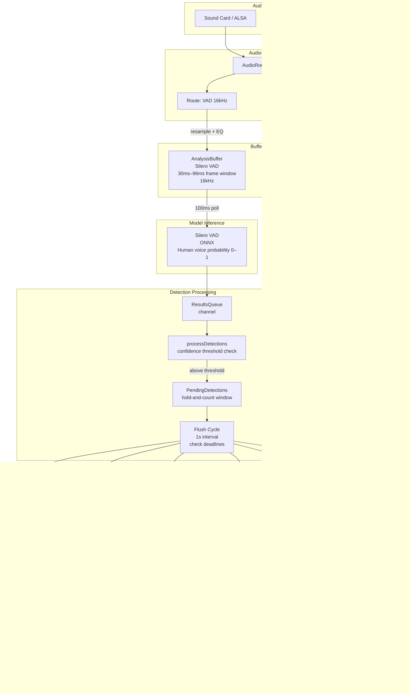
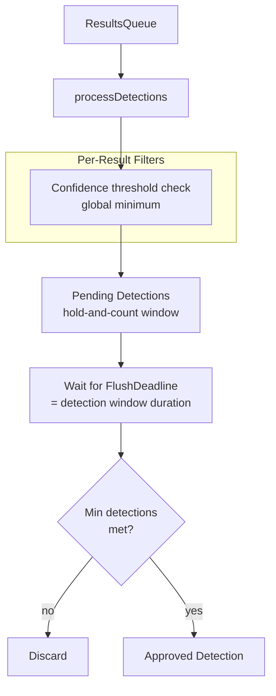
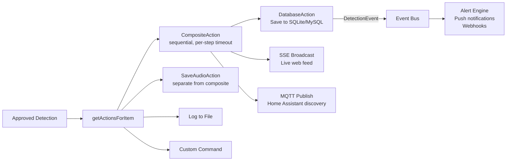
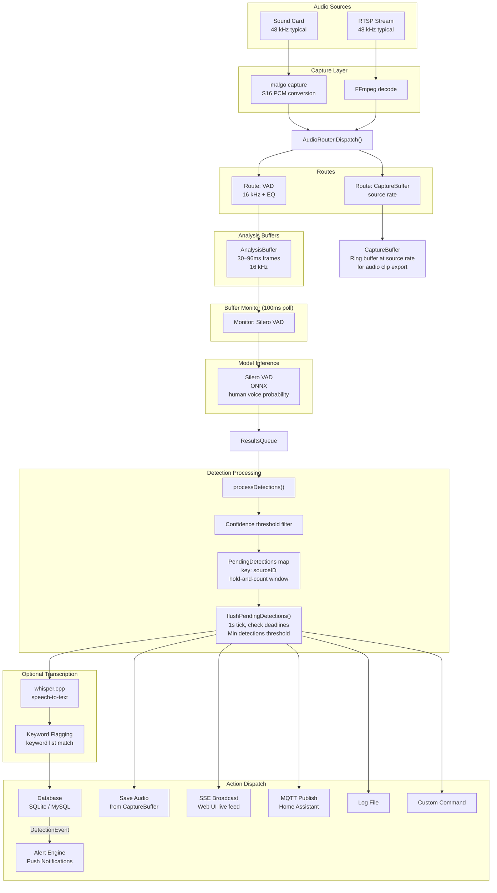

# VoiceWatch Detection Pipeline

This document explains how audio flows through VoiceWatch's voice-detection pipeline, from hardware capture to stored detections and notifications.

## Pipeline Overview

## Stage 1: Audio Capture

Audio enters the system from two source types:

- **Sound cards** (via malgo/miniaudio): The `startCapture()` function opens the device and receives PCM frames in a hardware callback. Non-S16 formats (S24, S32, F32) are converted to 16-bit signed PCM. Each frame is wrapped in an `AudioFrame` with source ID, sample rate, bit depth, and timestamp.
- **RTSP streams** (via FFmpeg): An FFmpeg process decodes the network stream and produces the same `AudioFrame` type.

All frames are dispatched through the `AudioRouter`, which fans out each frame to registered routes via per-route buffered channels (capacity 64). Each route can apply gain adjustment and EQ filter chains.

## Stage 2: Buffering

The `AudioRouter` drives two parallel paths:

- **VAD Analysis Buffer**: Audio is resampled to 16 kHz (Silero VAD's required rate) and fed into an `AnalysisBuffer`. The buffer uses 30 ms or 96 ms frame windows (Silero VAD supports both).
- **CaptureBuffer**: A separate ring buffer stores raw audio at the original source sample rate. This buffer is not used for inference; its purpose is to provide audio clip data when a detection is confirmed and needs to be saved to disk.

The **Continuous Full-Audio Capture** feature supplements the clip-based `CaptureBuffer` with rolling chunks written to disk at configurable intervals, ensuring no audio is lost between trigger events.

## Stage 3: VAD Inference

An `analysisBufferMonitor` goroutine polls the VAD analysis buffer at 100 ms intervals. When a full frame is available:

1. Raw PCM bytes are converted to `[]float32`
2. `Orchestrator.PredictModel("SileroVAD", samples)` dispatches to the ONNX model
3. The model outputs a single probability score (0.0–1.0) representing the likelihood that the frame contains human speech
4. The result is sent to the shared `ResultsQueue` channel

### Sample Rate

| Model | Inference Rate | Source Capture Rate | Resampling |
|-------|---------------|-------------------|------------|
| Silero VAD | 16 kHz | Source rate (typically 48 kHz) | Downsampled by router |

## Stage 4: Detection Processing

A single goroutine reads from `ResultsQueue` and applies filtering:

1. **Confidence threshold**: Frames where VAD probability falls below the configured minimum are discarded immediately.

### Hold-and-Count Window

Approved frames are held in a `PendingDetection` until the flush deadline. The key is `sourceID` (one pending detection per source at a time).

The pending detection tracks:
- `HitCount`: number of frames above threshold within the window
- `MaxConfidence`: highest probability seen in the window
- `FlushDeadline`: when to evaluate the detection for approval

At flush time, `HitCount` is checked against the minimum-detections threshold (derived from the `overlap`/`trigger` setting). If the count is sufficient, the detection is approved; otherwise it is discarded as a spurious noise burst.

## Stage 5: Transcription and Keyword Flagging (Optional)

When **Transcription** is enabled in settings, an approved detection triggers whisper.cpp to transcribe the audio clip:

1. The audio captured in `CaptureBuffer` for the detection window is passed to the whisper.cpp backend
2. whisper.cpp produces a text transcript
3. The **Keyword Flagging** stage checks the transcript against the user-configured keyword list (case-sensitive or case-insensitive depending on settings)
4. If a keyword matches, the detection is stored with a `keyword_flagged = true` marker and the matching keyword is recorded
5. If transcription is enabled but no keyword is matched, the detection is stored as a plain transcribed detection without a flag

Transcription is always performed on a confirmed voice detection — keyword flagging is the only step that adds extra metadata; it does not gate whether the detection is saved.

## Stage 6: Action Dispatch

When a pending detection's flush deadline arrives and it passes the minimum-detections check, it becomes an approved detection. The processor builds a list of actions and enqueues each as a `Task` on the `JobQueue`.

**CompositeAction** wraps Database, SSE, and MQTT as sequential steps. `SaveAudioAction` runs separately to avoid slow FFmpeg encoding blocking the real-time broadcast.

### Audio Export

Audio is read from the `CaptureBuffer` ring buffer, which stores raw PCM at the original source rate. The clip covers the configured pre-capture buffer plus the detection window.

### JobQueue

The `JobQueue` is a bounded queue with retry/backoff support. MQTT actions have configurable retry policies. `SaveAudioAction` for Extended Capture uses exponential backoff (1s to 30s, up to ~20 minutes for long captures).

## Complete Data Flow Summary

